# Microbiomics
Figure generation R package oriented for microbiome data

## This R package enables the generation of highly customizable figures from microbiome data.

The test dataset described here comes from (MacPherson al., (2018), Scientific Reports; PMID:30046129)
```
setwd("./") # for testing purposes, should be the root directory of the repo.
source("./R/Microbiomics.R")
```
or library(Microbiomics) if package is installed.
```
mapping_file = "./data/mapping_file.tsv"
taxonomy_file = "./data/feature_table_final_normalized_L6.tsv"
outdir = "./output"
```

Before starting, lets have a look at the mapping_file.tsv
```
#SampleID    Groups  Gender  Treatment   Date        Visit
#2v2.A       A       Female  v2.A        2014-01-12  v2
#2v3.A       A       Female  v3.A        2014-01-20  v3
#2v4.A       A       Female  v4.A        2014-01-28  v4
#2v5.A       A       Female  v5.A        2014-02-03  v5
#4v2.A       A       Female  v2.A        2014-01-12  v2
```
and the taxonomic summary file:
```
#Taxon                                                                                                     72v3.B  60v2.B  11v2.B  75v3.A  36v5.A  70v4.B ...
#k__Bacteria;p__Firmicutes;c__Clostridia;o__Clostridiales;f__Christensenellaceae;g__ChristensenellaceaeFA  33.6    50.0    34.2    33.6    34.9    90.0   ...
#k__Bacteria;p__Firmicutes;c__Clostridia;o__Clostridiales;f__Clostridiaceae;g__02d06                       6.6     9.4     7.2     6.9     6.6     14.5   ...
#k__Bacteria;p__Firmicutes;c__Clostridia;o__Clostridiales;f__Clostridiaceae;g__ClostridiaceaeFA            32.7    24.7    6.7     5.1     62.4    5.4    ...
#k__Bacteria;p__Firmicutes;c__Clostridia;o__Clostridiales;f__Clostridiaceae;g__Clostridium                 491.4   166.9   39.9    98.8    11.5    63.3   ...
#k__Bacteria;p__Firmicutes;c__Clostridia;o__Clostridiales;f__Clostridiaceae;g__SMB53                       15.1    17.4    55.9    13.8    683.8   19.8   ...
#k__Bacteria;p__Firmicutes;c__Clostridia;o__Clostridiales;f__Clostridiaceae;g__Sarcina                     0.9     0.9     0.9     0.9     0.9     0.9    ...
#k__Bacteria;p__Firmicutes;c__Clostridia;o__Clostridiales;f__ClostridialesOR;g__ClostridialesOR            196.0   328.0   258.4   501.1   297.0   613.8  ...
#k__Bacteria;p__Firmicutes;c__Clostridia;o__Clostridiales;f__Dehalobacteriaceae;g__DehalobacteriaceaeFA    0.6     0.6     0.6     0.6     0.6     10.7   ...
#k__Bacteria;p__Firmicutes;c__Clostridia;o__Clostridiales;f__Dehalobacteriaceae;g__Dehalobacterium         3.9     6.1     3.9     3.9     3.9     5.5    ...
```

Let's start by generating a stacked barplot of all samples. The ```stackedBarplotsFromTaxonomyTable()``` function will return a ggplot object.
The following options are mutually exclusive ```mapping_file=<path_to_file>```, and ```mapping=<data.frame>```
One of the important options of ```stackedBarplotsFromTaxonomyTable()``` and the figure generating functions in the Microbiomics package in
general is the ```facets=c("variable1")``` or ```facets=c("variable1", "variable2")``` parameter. If we only specify a 1-element vector, the figure
will be divided in panels along the X-axis. For instance, for the following line, if we specify ```facets=c("Visit")```, we'll obtain the
following figure which will plot the read counts of each taxa of each sample:

Let's also specify that we want all the plots to be generated to up to the genus level
```
tax_level = "L6"

p_object_1 = stackedBarplotsFromTaxonomyTable(
    mapping_file=mapping_file, mapping=NULL,                taxonomy_file,              outdir=outdir,          facets=c("Visit"),
    tax_level=tax_level,       pretty_display=FALSE,        by_average=FALSE,           summarize_lineage=TRUE, order_files=NULL,
    selected_taxa=NULL,        relative_abundance=FALSE,    keep_most_n=20,             remove_n=NULL,          show_borders=FALSE,
    order_bars_by_taxon=NULL,  side_by_side=FALSE,          type="16S_amplicons",       png=FALSE,              pdf=FALSE,
    prefix=NULL,               remove_legend=FALSE,         pretty_display_showx=FALSE, exclude_string=NULL,    defined_width=NULL,
    defined_height=NULL,       show_samples_on_labels=NULL, specific_color_list=NULL,   sample_order=NULL,      legend_pos="right",
    legend_ncol=1,             verbose=0,                   range=NULL
)
print(p_object_1)
```
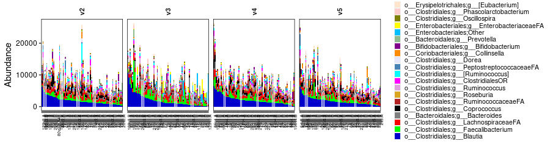
*Figure 1*

First, we can convert the raw counts to % values to make profiles of each sample easier to compare.
```
p_object_2 = stackedBarplotsFromTaxonomyTable(
  mapping_file=mapping_file, mapping=NULL,                taxonomy_file,              outdir=outdir,          facets=c("Visit"),
  tax_level=tax_level,       pretty_display=FALSE,        by_average=FALSE,           summarize_lineage=TRUE, order_files=NULL,
  selected_taxa=NULL,        relative_abundance=TRUE,     keep_most_n=20,             remove_n=NULL,          show_borders=FALSE,
  order_bars_by_taxon=NULL,  side_by_side=FALSE,          type="16S_amplicons",       png=FALSE,              pdf=FALSE,
  prefix=NULL,               remove_legend=FALSE,         pretty_display_showx=FALSE, exclude_string=NULL,    defined_width=NULL,
  defined_height=NULL,       show_samples_on_labels=NULL, specific_color_list=NULL,   sample_order=NULL,      legend_pos="right",
  legend_ncol=1,             verbose=0,                   range=NULL
)
print(p_object_2)
```
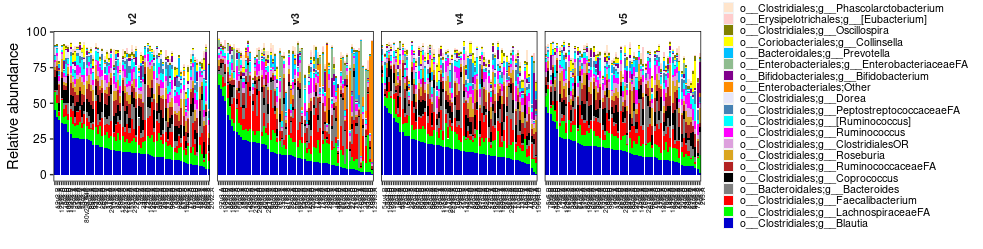
*Figure 2*

Which is a little better. We can also simplify the taxonomic lineages a bit with the summarize_lineage=TRUE argument.
```
p_object_3 = stackedBarplotsFromTaxonomyTable(
  mapping_file=mapping_file, mapping=NULL,                taxonomy_file,              outdir=outdir,          facets=c("Visit"),
  tax_level=tax_level,       pretty_display=FALSE,        by_average=FALSE,           summarize_lineage=TRUE, order_files=NULL,
  selected_taxa=NULL,        relative_abundance=TRUE,     keep_most_n=20,             remove_n=NULL,          show_borders=FALSE,
  order_bars_by_taxon=NULL,  side_by_side=FALSE,          type="16S_amplicons",       png=FALSE,              pdf=FALSE,
  prefix=NULL,               remove_legend=FALSE,         pretty_display_showx=FALSE, exclude_string=NULL,    defined_width=NULL,
  defined_height=NULL,       show_samples_on_labels=NULL, specific_color_list=NULL,   sample_order=NULL,      legend_pos="right",
  legend_ncol=1,             verbose=0,                   range=NULL
)
print(p_object_3)
```
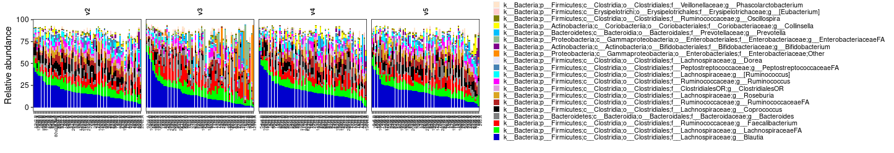
*Figure 3*

We should also order the barplot by the abundance of a taxon. By default, the panels are sorted by the most abundant taxa which here is o__Clostridiales;g__Blautia.
But say we'd like to order the plots by "o__Clostridiales;g__Coprococcus":
```
p_object_4 = stackedBarplotsFromTaxonomyTable(
  mapping_file=mapping_file,                              mapping=NULL,                taxonomy_file,              outdir=outdir,         facets=c("Visit"),
  tax_level=tax_level,                                    pretty_display=FALSE,        by_average=FALSE,           summarize_lineage=TRUE, order_files=NULL,
  selected_taxa=NULL,                                     relative_abundance=TRUE,     keep_most_n=20,             remove_n=NULL,          show_borders=FALSE,
  order_bars_by_taxon="o__Clostridiales;g__Coprococcus",  side_by_side=FALSE,          type="16S_amplicons",       png=FALSE,              pdf=FALSE,
  prefix=NULL,                                            remove_legend=FALSE,         pretty_display_showx=FALSE, exclude_string=NULL,    defined_width=NULL,
  defined_height=NULL,                                    show_samples_on_labels=NULL, specific_color_list=NULL,   sample_order=NULL,      legend_pos="right",
  legend_ncol=1,                                          verbose=0,                   range=NULL
)
print(p_object_4)
```
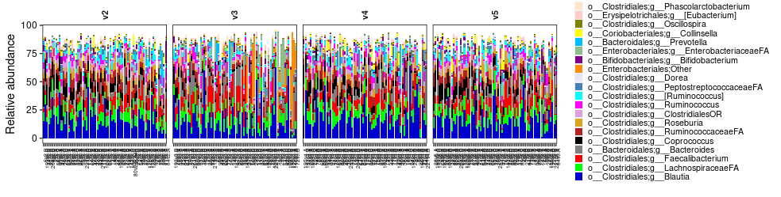
*Figure 4*

We may then want to focus on certain taxa. Say we would want to show only g__Coproccus, o__Enterobacteriales:Others and g__Prevotella
```
p_object_5 = stackedBarplotsFromTaxonomyTable(
  mapping_file=mapping_file,                                                  mapping=NULL,                taxonomy_file,              outdir=outdir,          facets=c("Visit"),
  tax_level=tax_level,                                                        pretty_display=FALSE,        by_average=FALSE,           summarize_lineage=TRUE, order_files=NULL,
  selected_taxa=c("g__Coprococcus", "o__Enterobacteriales", "g__Prevotella"), relative_abundance=TRUE,     keep_most_n=20,             remove_n=NULL,          show_borders=FALSE,
  order_bars_by_taxon="o__Clostridiales;g__Coprococcus",                      side_by_side=FALSE,          type="16S_amplicons",       png=FALSE,              pdf=FALSE,
  prefix=NULL,                                                                remove_legend=FALSE,         pretty_display_showx=FALSE, exclude_string=NULL,    defined_width=NULL,
  defined_height=NULL,                                                        show_samples_on_labels=NULL, specific_color_list=NULL,   sample_order=NULL,      legend_pos="right",
  legend_ncol=1,                                                              verbose=0,                   range=NULL
)
print(p_object_5)
```
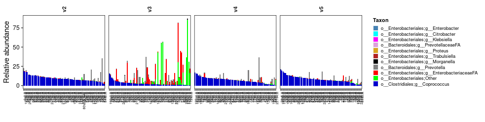
*Figure 5*

That's already more interesting. We can also split by groups (individuals who received the probiotic and the ones that did not).
In that case we would include : facets=c("Visit", "Groups")
```
p_object_6 = stackedBarplotsFromTaxonomyTable(
  mapping_file=mapping_file,                                                  mapping=NULL,                taxonomy_file,              outdir=outdir,          facets=c("Groups", "Visit"),
  tax_level=tax_level,                                                        pretty_display=FALSE,        by_average=FALSE,           summarize_lineage=TRUE, order_files=NULL,
  selected_taxa=c("g__Coprococcus", "o__Enterobacteriales", "g__Prevotella"), relative_abundance=TRUE,     keep_most_n=20,             remove_n=NULL,          show_borders=FALSE,
  order_bars_by_taxon="o__Clostridiales;g__Coprococcus",                      side_by_side=FALSE,          type="16S_amplicons",       png=FALSE,              pdf=FALSE,
  prefix=NULL,                                                                remove_legend=FALSE,         pretty_display_showx=FALSE, exclude_string=NULL,    defined_width=NULL,
  defined_height=NULL,                                                        show_samples_on_labels=NULL, specific_color_list=NULL,   sample_order=NULL,      legend_pos="right",
  legend_ncol=1,                                                              verbose=0,                   range=NULL
)
print(p_object_6)
```
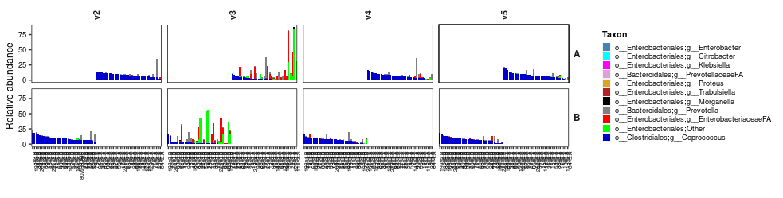
*Figure 6*

Which is nice, but we should remove the empty space with pretty_display=TRUE
```
p_object_7 = stackedBarplotsFromTaxonomyTable(
  mapping_file=mapping_file,                                                  mapping=NULL,                taxonomy_file,              outdir=outdir,          facets=c("Groups", "Visit"),
  tax_level=tax_level,                                                        pretty_display=TRUE,         by_average=FALSE,           summarize_lineage=TRUE, order_files=NULL,
  selected_taxa=c("g__Coprococcus", "o__Enterobacteriales", "g__Prevotella"), relative_abundance=TRUE,     keep_most_n=20,             remove_n=NULL,          show_borders=FALSE,
  order_bars_by_taxon="o__Clostridiales;g__Coprococcus",                      side_by_side=FALSE,          type="16S_amplicons",       png=FALSE,              pdf=FALSE,
  prefix=NULL,                                                                remove_legend=FALSE,         pretty_display_showx=FALSE, exclude_string=NULL,    defined_width=NULL,
  defined_height=NULL,                                                        show_samples_on_labels=NULL, specific_color_list=NULL,   sample_order=NULL,      legend_pos="right",
  legend_ncol=1,                                                              verbose=0,                   range=NULL,                 angle_strip_labels_x=0
)
print(p_object_7)
```
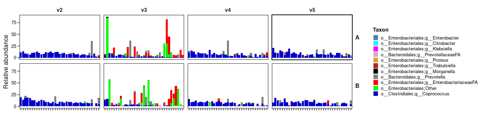
*Figure 7*

So all of this is great, but so far we've only considered the most 20 abundant taxa, but what about the next following 20 (range=c(21,40))? We'll go back to a single facet (facets=c("Visit"))
```
p_object_8 = stackedBarplotsFromTaxonomyTable(
  mapping_file=mapping_file,  mapping=NULL,                taxonomy_file,              outdir=outdir,          facets=c("Visit"),
  tax_level=tax_level,        pretty_display=TRUE,         by_average=FALSE,           summarize_lineage=TRUE, order_files=NULL,
  selected_taxa=NULL,         relative_abundance=TRUE,     keep_most_n=NULL,           remove_n=NULL,          show_borders=FALSE,
  order_bars_by_taxon=NULL,   side_by_side=FALSE,          type="16S_amplicons",       png=FALSE,              pdf=FALSE,
  prefix=NULL,                remove_legend=FALSE,         pretty_display_showx=FALSE, exclude_string=NULL,    defined_width=NULL,
  defined_height=NULL,        show_samples_on_labels=NULL, specific_color_list=NULL,   sample_order=NULL,      legend_pos="right",
  legend_ncol=1,              verbose=0,                   range=c(21,40),             angle_strip_labels_x=0
)
print(p_object_8)
```
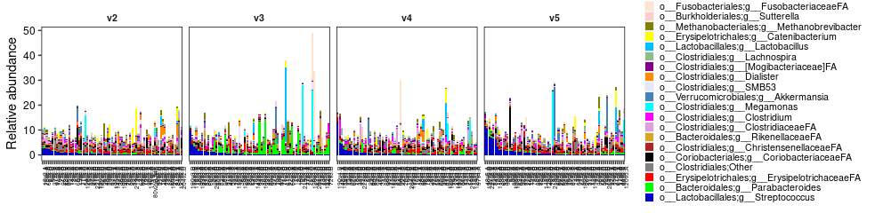
*Figure 8*

So all of this is great, but so far we've only considered the most 20 abundant taxa, but what about the next following 20?
```
p_object_9 = stackedBarplotsFromTaxonomyTable(
  mapping_file=mapping_file,   mapping=NULL,                taxonomy_file,              outdir=outdir,          facets=c("Visit"),
  tax_level=tax_level,         pretty_display=TRUE,         by_average=FALSE,           summarize_lineage=TRUE, order_files=NULL,
  selected_taxa=NULL,          relative_abundance=TRUE,     keep_most_n=NULL,           remove_n=NULL,          show_borders=FALSE,
  order_bars_by_taxon=NULL,    side_by_side=FALSE,          type="16S_amplicons",       png=FALSE,              pdf=FALSE,
  prefix=NULL,                 remove_legend=FALSE,         pretty_display_showx=FALSE, exclude_string=NULL,    defined_width=NULL,
  defined_height=NULL,         show_samples_on_labels=NULL, specific_color_list=NULL,   sample_order=NULL,      legend_pos="right",
  legend_ncol=1,               verbose=0,                   range=c(41,60),             angle_strip_labels_x=0
)
print(p_object_9)
```
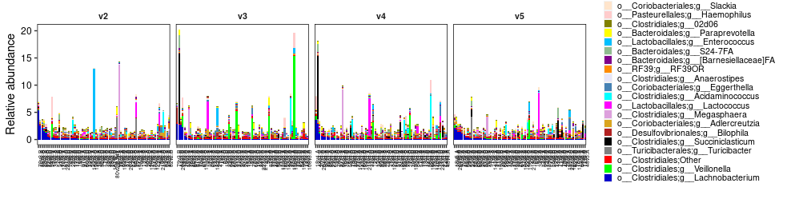
*Figure 9*

Okay that's all good for getting a global overview of the taxa profiles at stake.
Now let's extract the taxa that are significantly differentially abundant between conditions.
```
anova_df = findDifferentialTaxaByAnova(
  mapping_file=mapping_file,                         mapping=NULL,                       taxonomy_file=taxonomy_file,
  variables=list("VisitCategory"=c("v3", "v2v4v5")), convert_to_relative_abundance=TRUE
)
```
Let's select that comparions that had p-value<0.05
```
anova_df2 = anova_df[anova_df$pvalue < 0.05,]
```
Then select taxa that had ratio mean1/mean2 > 10 or mean2/mean1 < 1/10 (i.e. fold-change)
```
fc=3
fc_rev = 1/fc
anova_df3 = anova_df2[(anova_df2$mean_1/anova_df2$mean_2 >= fc) | (anova_df2$mean_1/anova_df2$mean_2 <= fc_rev), ]
```

Then lets replot the figure with only the selected taxa. #TODO always sort X axis by the most abundant taxa, by default
```
p_object_10 = stackedBarplotsFromTaxonomyTable(
  mapping_file=mapping_file,                                mapping=NULL,                taxonomy_file,              outdir=outdir,          facets=c("Visit"),
  tax_level=tax_level,                                      pretty_display=TRUE,         by_average=FALSE,           summarize_lineage=TRUE, order_files=NULL,
  selected_taxa=anova_df3$Taxa,                             relative_abundance=TRUE,     keep_most_n=20,             remove_n=NULL,          show_borders=FALSE,
  order_bars_by_taxon=NULL,                                 side_by_side=FALSE,          type="16S_amplicons",       png=FALSE,              pdf=FALSE,
  prefix=NULL,                                              remove_legend=FALSE,         pretty_display_showx=FALSE, exclude_string=NULL,    defined_width=NULL,
  defined_height=NULL,                                      show_samples_on_labels=NULL, specific_color_list=NULL,   sample_order=NULL,      legend_pos="right",
  legend_ncol=1,                                            verbose=0,                   range=NULL,                 angle_strip_labels_x=0
)
print(p_object_10)
```
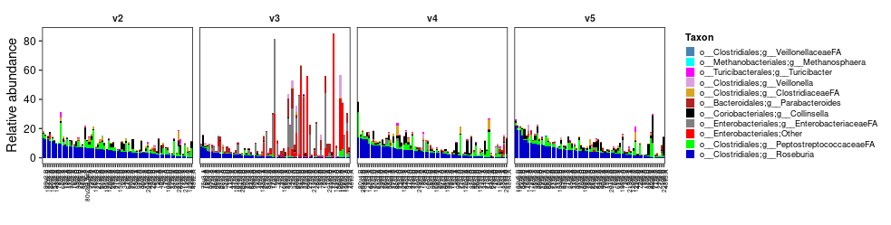
*Figure 10*

It's actually pretty neat. The microbiota was largely impacted at visit #3 which happened right after the antibiotic intake.
These microbes could potentially be used as markers to detect a disrupted microbiota.
Let's now generate a taxonomy abundance table with only these selected taxa.
```
tax_df = data.frame(fread(taxonomy_file, header=T), check.names=F)
tax_df = tax_df[tax_df$Taxon %in% anova_df3$Taxa,]
write.table(tax_df, "./data/feature_table_final_normalized_L6_diffabun_v1.tsv", quote=F, sep="\t", row.names=F)
```

We can then focus on certain taxa and plot the bars side-by-side (side_by_side=TRUE) with standard deviation instead of stacked barplots:
```
selected_taxa = c(
  "o__Enterobacteriales"
)

p_object_11 = stackedBarplotsFromTaxonomyTable(
  mapping_file=mapping_file,                                mapping=NULL,                taxonomy_file,              outdir=outdir,          facets=c("Visit"),
  tax_level=tax_level,                                      pretty_display=TRUE,         by_average=TRUE,            summarize_lineage=TRUE, order_files=NULL,
  selected_taxa=selected_taxa,                              relative_abundance=TRUE,     keep_most_n=20,             remove_n=NULL,          show_borders=FALSE,
  order_bars_by_taxon=NULL,                                 side_by_side=TRUE,           type="16S_amplicons",       png=FALSE,              pdf=FALSE,
  prefix=NULL,                                              remove_legend=FALSE,         pretty_display_showx=FALSE, exclude_string=NULL,    defined_width=NULL,
  defined_height=NULL,                                      show_samples_on_labels=NULL, specific_color_list=NULL,   sample_order=NULL,      legend_pos="right",
  legend_ncol=1,                                            verbose=0,                   range=NULL,                 angle_strip_labels_x=0
)
print(p_object_11)
```
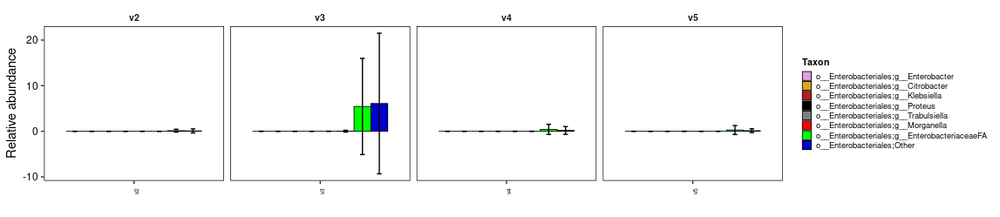
*Figure 11*
